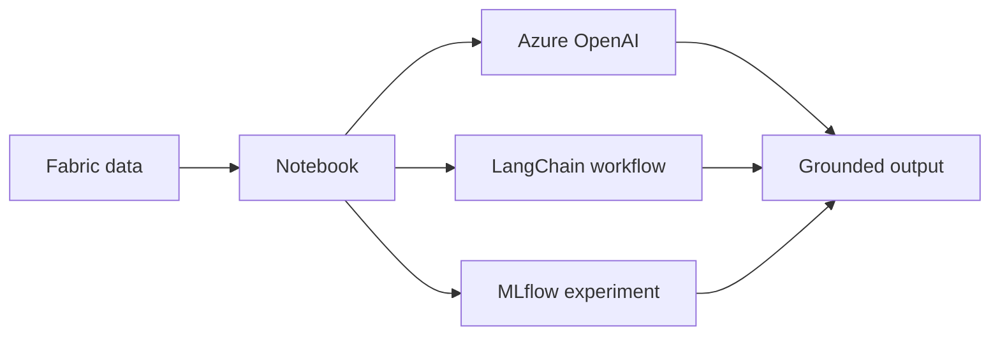

# AI and LLMs

This lab explores practical generative AI and data science patterns in Fabric, including Azure OpenAI integration, LangChain workflows, document-oriented analysis, and MLflow-backed model tracking.

## Learning objectives

- Configure Azure OpenAI connectivity for a Fabric-oriented workflow.
- Build prompt templates and processing chains with LangChain.
- Apply large-scale document/literature-review patterns to extract useful content.
- Train, track, compare, and register machine-learning models with MLflow.

## Lab notebook

The [Fabric LLM overview sample notebook](https://github.com/Cloud2BR-MSFTLearningHub/MS-Fabric-Essentials-Workshop/blob/main/AzurePortal/2_AI_LLMs/src/fabric-llms-overview_sample.ipynb) contains the runnable example. Work through it only after configuring the required Fabric, Azure OpenAI, identity, and network access settings described in the [AI and LLMs guide](https://github.com/Cloud2BR-MSFTLearningHub/MS-Fabric-Essentials-Workshop/blob/main/AzurePortal/2_AI_LLMs/README.md).

!!! warning
    Do not send sensitive or regulated data to external model endpoints without an approved data-handling design. Validate identities, tenant settings, access controls, regional availability, and model usage costs.

## Suggested validation

1. Confirm the notebook can authenticate without embedding credentials.
2. Test prompts with non-sensitive sample data before connecting production sources.
3. Review generated outputs for grounding, accuracy, and safety requirements.
4. Record experiment parameters and evaluation evidence with the model artifact.