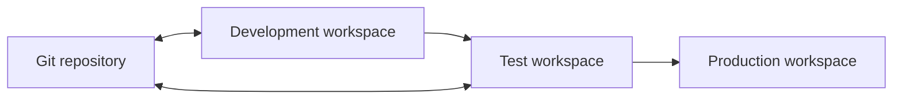

# Delivery and operations

Fabric delivery benefits from treating workspaces, items, and infrastructure as managed assets. This workshop introduces deployment pipelines for environment promotion and Git integration for versioned collaboration.

## Deployment pipelines

Use deployment pipelines to promote compatible Fabric content across development, test, and production. Plan the release path first: identify environment-specific values, owners, approvals, validation evidence, and rollback steps.

The [deployment pipelines guide](https://github.com/Cloud2BR-MSFTLearningHub/MS-Fabric-Essentials-Workshop/blob/main/AzurePortal/4_CICD/0_deployment-pipelines/README.md) includes the detailed setup and workshop examples.

## Git integration

Git integration connects a Fabric workspace to a repository so teams can commit, review, update, and revert supported Fabric items. Workspace administrators establish the connection; contributors need the appropriate workspace and repository permissions.

Use the [Git integration guide](https://github.com/Cloud2BR-MSFTLearningHub/MS-Fabric-Essentials-Workshop/blob/main/AzurePortal/4_CICD/1_github-integration.md) for detailed connection, commit, update, and disconnect procedures.

## Release checklist

- Confirm the target workspace and branch are correct.
- Review changed item definitions and environment-specific configuration.
- Validate data refreshes, semantic models, notebooks, and report behavior in the target stage.
- Record approver, deployment result, and rollback decision.
- Keep infrastructure credentials and access tokens outside the repository.