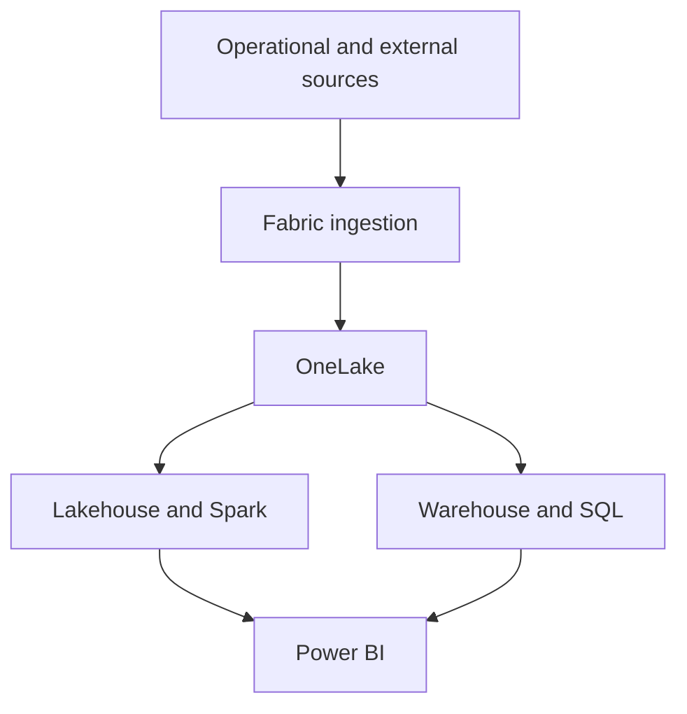

# Fabric foundations

Microsoft Fabric is a SaaS analytics platform that combines familiar Power BI, Azure Synapse Analytics, and Azure Data Factory experiences. It gives teams a shared data estate through OneLake while retaining specialized experiences for engineering, warehousing, science, real-time analytics, and reporting.

## Workloads in the workshop

| Workload | Workshop relevance |
| --- | --- |
| Data Factory | Ingest and orchestrate data movement and transformation. |
| Data Engineering | Use Spark-based notebooks to prepare and transform data. |
| Data Warehouse | Query structured, curated data with SQL analytics. |
| Data Science | Train, evaluate, and register models with MLflow patterns. |
| Power BI | Build reports and semantic models from governed data. |
| Data Activator | React to data events with operational automation. |

## OneLake and storage choices

OneLake reduces unnecessary data copies by providing a shared logical lake for the organization. In the workshop, use the lakehouse flow for raw-to-curated transformations; select warehouses where relational SQL reporting is the natural interface.

## Concepts to recognize

- **Parquet and Delta:** open table formats used for efficient analytical storage and reliable table operations.
- **Shortcuts and mirroring:** connect to data without treating every scenario as a full copy-and-paste migration.
- **V-Order and Z-Order:** storage and data-layout optimizations that can improve analytical performance for suitable workloads.
- **Purview integration:** governance, discovery, security, lineage, and compliance remain part of the data platform lifecycle.

See the source [Fabric overview](https://github.com/Cloud2BR-MSFTLearningHub/MS-Fabric-Essentials-Workshop/blob/main/0_Overview.md) and [Microsoft Fabric documentation](https://learn.microsoft.com/fabric/) for current product details.