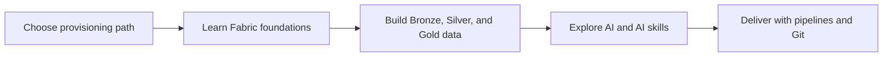

# Microsoft Fabric Essentials Workshop

Microsoft Fabric brings data integration, engineering, warehousing, real-time analytics, data science, and Power BI together around OneLake. This workshop provides a guided foundation that can be completed through the Azure portal or with Terraform-managed infrastructure.

!!! warning
    This is learning material. Confirm current Microsoft Fabric availability, capacity SKUs, pricing, security, and governance requirements in [Microsoft Learn](https://learn.microsoft.com/fabric/) before production use.

{ loading=lazy }

<a class="guide-card" href="fabric-foundations/">
<strong>Fabric foundations</strong>
Understand OneLake, core workloads, and data storage choices.
</a>

<a class="guide-card" href="provision-the-workshop/">
<strong>Provision the workshop</strong>
Choose Azure portal setup or Terraform infrastructure as code.
</a>

<a class="guide-card" href="medallion-architecture/">
<strong>Medallion architecture</strong>
Transform sample order data from Bronze through Gold with Fabric notebooks.
</a>

<a class="guide-card" href="ai-and-llms/">
<strong>AI and LLMs</strong>
Connect Azure OpenAI, LangChain, and Fabric data science patterns.
</a>

<a class="guide-card" href="delivery-and-operations/">
<strong>Delivery and operations</strong>
Use deployment pipelines and Git integration to deliver Fabric content.
</a>

## Workshop path

## Start here

| You need to | Start with |
| --- | --- |
| Understand the Fabric landscape and OneLake | [Fabric foundations](fabric-foundations.md) |
| Create capacity and workshop resources | [Provision the workshop](provision-the-workshop.md) |
| Process the provided sample data | [Medallion architecture](medallion-architecture.md) |
| Add generative AI patterns | [AI and LLMs](ai-and-llms.md) |
| Move work safely across environments | [Delivery and operations](delivery-and-operations.md) |

## Prerequisites

- An Azure subscription and appropriate access to create and manage workshop resources.
- Contributor permissions, or an equivalent custom role, for the required scope.
- For the Terraform path: [Terraform](https://developer.hashicorp.com/terraform/install) and the [Azure CLI](https://learn.microsoft.com/cli/azure/install-azure-cli).

The original workshop source, notebooks, Terraform templates, and sample files remain available in the [GitHub repository](https://github.com/Cloud2BR-MSFTLearningHub/MS-Fabric-Essentials-Workshop).