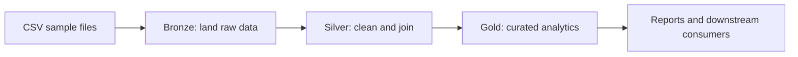

# Medallion architecture

The engineering lab applies a medallion design to sample order and product data. Each layer has a distinct contract: Bronze preserves landing data, Silver cleans and conforms it, and Gold exposes trusted analytical outputs.

## Lab assets

| Asset | Purpose |
| --- | --- |
| [`2020orders.csv`](https://github.com/Cloud2BR-MSFTLearningHub/MS-Fabric-Essentials-Workshop/blob/main/AzurePortal/1_MedallionArch/sample_files/2020orders.csv) | Sample transaction data for the lab. |
| [`products.csv`](https://github.com/Cloud2BR-MSFTLearningHub/MS-Fabric-Essentials-Workshop/blob/main/AzurePortal/1_MedallionArch/sample_files/products.csv) | Product reference data for the lab. |
| [`0_notebook_bronze_to_silver.ipynb`](https://github.com/Cloud2BR-MSFTLearningHub/MS-Fabric-Essentials-Workshop/blob/main/AzurePortal/1_MedallionArch/src/0_notebook_bronze_to_silver.ipynb) | Landing, cleansing, and Silver transformation notebook. |
| [`1_notebook_silver_to_gold.ipynb`](https://github.com/Cloud2BR-MSFTLearningHub/MS-Fabric-Essentials-Workshop/blob/main/AzurePortal/1_MedallionArch/src/1_notebook_silver_to_gold.ipynb) | Curated Gold-layer transformation notebook. |

## Implementation sequence

1. Upload or access the provided sample files in the intended Fabric storage location.
2. Run the Bronze-to-Silver notebook and inspect schema, data quality, and join logic.
3. Run the Silver-to-Gold notebook to create curated outputs for analytical use.
4. Validate row counts and business keys between layers before reporting.

The original [Medallion Architecture guide](https://github.com/Cloud2BR-MSFTLearningHub/MS-Fabric-Essentials-Workshop/blob/main/AzurePortal/1_MedallionArch/README.md) contains the detailed portal steps and the source [draw.io architecture diagram](https://github.com/Cloud2BR-MSFTLearningHub/MS-Fabric-Essentials-Workshop/blob/main/AzurePortal/1_MedallionArch/docs/FabricMedallionArch.drawio).