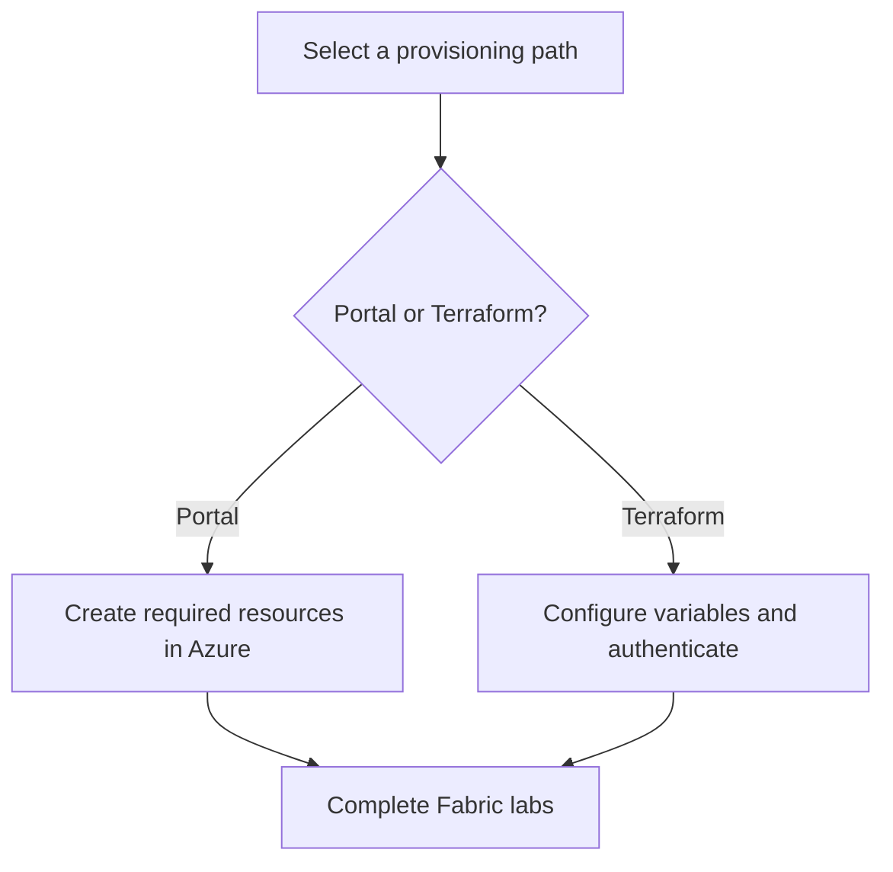

# Provision the workshop

The workshop supports two equivalent infrastructure paths. Choose one before beginning the hands-on labs, then continue through the learning sequence.

## Choose a path

| Path | Best when | Outcome |
| --- | --- | --- |
| Azure portal | You are learning the resource setup visually or do not need a reusable deployment definition. | Create the workshop resources in the Azure UI. |
| Terraform | You need repeatable, reviewed infrastructure provisioning. | Deploy Fabric capacity and the workshop's supporting resources from code. |



## Terraform quick start

The repository's Terraform configuration provisions Microsoft Fabric capacity and a public-network SQL Server/database used by the workshop. Review `terraform.tfvars` carefully, especially the administrator principal and SKU, before applying changes.

```sh
cd Terraform/src
az login
terraform init
terraform plan -var-file terraform.tfvars
terraform apply -var-file terraform.tfvars
```

!!! danger
    The supplied templates can use an F64 capacity. Review the selected SKU and cost implications, pause capacity when it is not needed, and remove the resource group after finishing the workshop.

## Resources and troubleshooting

- Read the complete [Terraform deployment guide](https://github.com/Cloud2BR-MSFTLearningHub/MS-Fabric-Essentials-Workshop/blob/main/Terraform/README.md).
- Use the [troubleshooting guide](https://github.com/Cloud2BR-MSFTLearningHub/MS-Fabric-Essentials-Workshop/blob/main/Terraform/troubleshooting.md) for Terraform installation, resource group, and resource-not-found issues.
- Inspect the [Terraform source](https://github.com/Cloud2BR-MSFTLearningHub/MS-Fabric-Essentials-Workshop/tree/main/Terraform/src) before deployment and keep secrets out of committed `tfvars` files.